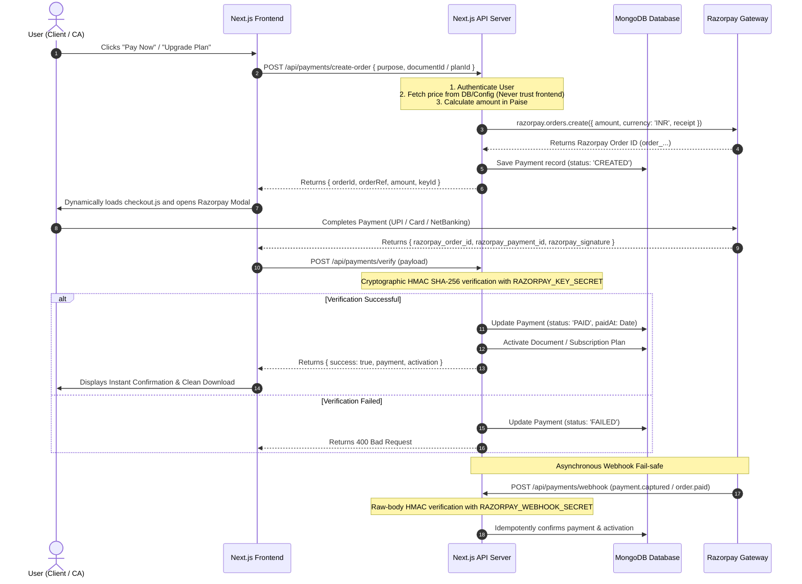

# 💳 Razorpay Payment Gateway Integration Guide — Smart CA Vault

This document provides a production-grade guide for configuring, testing, and managing the **Razorpay Payment Gateway** integrated into the **Smart CA Application**.

---

## 🏗️ 1. Architecture & Payment Flows

The integration supports two core monetization workflows:

```
                          ┌────────────────────────────────────────────────────────┐
                          │ 1. Taxpayer Client: Document Unlock & Download Fee     │
                          │ 2. CA Firm Owner: SaaS Subscription & Plan Upgrades   │
                          └────────────────────────────────────────────────────────┘
```

### Complete End-to-End Flow:



---

## 🔑 2. Environment Variables

Configure the following variables in your `.env` (or hosting platform like Vercel / AWS / Docker):

```env
# ------------------------------------------------------------------------------
# Razorpay Payment Gateway Configuration
# ------------------------------------------------------------------------------
RAZORPAY_KEY_ID=rzp_test_your_key_id_here
RAZORPAY_KEY_SECRET=your_razorpay_key_secret_here
RAZORPAY_WEBHOOK_SECRET=your_razorpay_webhook_secret_here
NEXT_PUBLIC_RAZORPAY_KEY_ID=rzp_test_your_key_id_here
```

> [!IMPORTANT]
> - `RAZORPAY_KEY_SECRET` and `RAZORPAY_WEBHOOK_SECRET` are **SERVER-ONLY** and must **NEVER** be prefixed with `NEXT_PUBLIC_` or sent to the browser.
> - `NEXT_PUBLIC_RAZORPAY_KEY_ID` or `RAZORPAY_KEY_ID` is the public key used by the frontend Razorpay Checkout widget.

---

## 🛠️ 3. Obtaining Test API Keys

1. Sign up or log into the [Razorpay Dashboard](https://dashboard.razorpay.com/).
2. Toggle the top-right environment switch to **Test Mode**.
3. Go to **Settings** $\rightarrow$ **API Keys**.
4. Click **Generate Test Key**.
5. Copy your **Key ID** (`rzp_test_...`) and **Key Secret**.
6. Paste them into your project's `.env` file.

---

## ⚡ 4. Webhook Configuration

Webhooks act as an automatic fail-safe ensuring payments are verified even if a user closes their browser before returning to the website.

1. In Razorpay Dashboard, navigate to **Settings** $\rightarrow$ **Webhooks**.
2. Click **Add New Webhook**.
3. **Webhook URL**:
   * For Production: `https://yourdomain.com/api/payments/webhook`
   * For Local Testing: Use ngrok/localtunnel: `https://xxxx.ngrok-free.app/api/payments/webhook`
4. **Secret**: Enter a secure random string (e.g. `ca_webhook_secret_2026_prod`) and save the same in `.env` under `RAZORPAY_WEBHOOK_SECRET`.
5. **Active Events**: Select the following events:
   * ✅ `payment.captured`
   * ✅ `order.paid`
   * ✅ `payment.failed`
6. Save Webhook.

---

## 🧪 5. Testing Payments in TEST MODE

When `RAZORPAY_KEY_ID` starts with `rzp_test_`, Razorpay accepts test payment instruments without debiting real money.

### A. Test UPI Payments
* In the Razorpay modal, select **UPI**.
* Enter any test VPA: `success@razorpay` (always succeeds) or `failure@razorpay` (simulates decline).

### B. Test Cards

| Card Type | Card Number | Expiry | CVV | OTP | Result |
| :--- | :--- | :--- | :--- | :--- | :--- |
| **Visa Success** | `4111 1111 1111 1111` | Any future date | `123` | Any 6 digits | ✅ Success |
| **Mastercard Success** | `5123 4567 8901 2345` | Any future date | `123` | Any 6 digits | ✅ Success |
| **Declined Card** | `4000 0000 0000 0002` | Any future date | `123` | N/A | ❌ Auto-Failed |

### C. Test NetBanking
* Select **NetBanking** $\rightarrow$ Choose **HDFC** or **SBI** $\rightarrow$ Click **Success** or **Failure** on the Razorpay simulator screen.

---

## 📦 6. Payment API Endpoints Reference

| Method | Endpoint | Auth Required | Description |
| :--- | :--- | :--- | :--- |
| `GET` | `/api/payments/config` | No | Returns public Razorpay key and subscription plans catalog |
| `POST` | `/api/payments/create-order` | Yes (JWT) | Calculates server-side amount, creates Razorpay order, saves DB record |
| `POST` | `/api/payments/verify` | Yes (JWT) | Cryptographically verifies HMAC signature and activates document/plan |
| `POST` | `/api/payments/webhook` | Webhook Signature | Idempotent webhook listener for `payment.captured`, `payment.failed`, `order.paid` |
| `GET` | `/api/payments/history` | Yes (JWT) | Retrieves user-specific or CA firm-specific payment receipts |
| `GET` | `/api/superadmin/payments` | Yes (Super Admin) | Platform-wide transaction ledger and revenue analytics |

---

## 🚀 7. Production Go-Live Checklist

Before switching to live customer payments:

1. **Activate Razorpay Live Account**: Complete KYC verification in the [Razorpay Dashboard](https://dashboard.razorpay.com/).
2. **Generate Live Keys**:
   * Switch the Dashboard toggle to **Live Mode**.
   * Go to **Settings** $\rightarrow$ **API Keys** $\rightarrow$ **Generate Live Key**.
3. **Update Production Environment Variables**:
   * Replace `rzp_test_...` with your `rzp_live_...` Key ID and Live Secret in your hosting environment.
4. **Configure Live Webhook**:
   * Register your production domain (`https://app.yourcadomain.com/api/payments/webhook`) under Live Webhooks.
5. **Verify HTTPS**: Ensure SSL/TLS certificate is active on your production server.
6. **Perform a ₹1 Live Test**: Run a live ₹1 test payment to verify bank settlement and automated invoice delivery.

---

## 🔒 8. Security Safeguards Implemented

* 🛡️ **Zero-Trust Pricing**: All transaction amounts are strictly looked up and calculated from server database records (`Document.paymentAmount`, `SUBSCRIPTION_PLANS`). No client-submitted amounts are trusted.
* 🔐 **Cryptographic Verification**: Signatures are verified using native Node.js `crypto.createHmac('sha256')`.
* 🛡️ **Raw-Body Webhook Verification**: `req.text()` raw payload stream is hashed directly with `RAZORPAY_WEBHOOK_SECRET` to prevent tampering.
* ⚡ **Idempotency Protection**: Webhook event IDs and order states prevent double fulfillment or duplicate credit.
* 🛑 **No PCI Data Stored**: No credit card numbers, CVVs, or UPI PINs ever touch the database or server.
